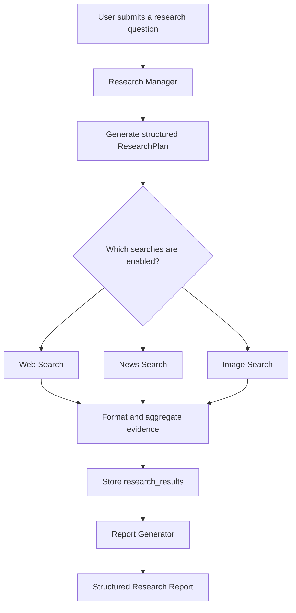
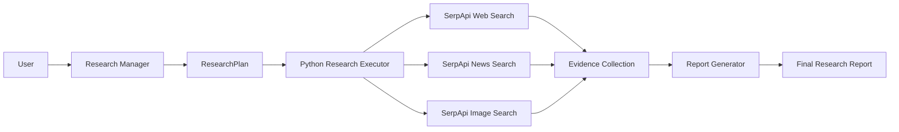

# 🔎 ResearchPilot — AI-Powered Research Agent

**ResearchPilot is an AI-powered research assistant that transforms natural-language questions into structured, evidence-based research reports using web search, news search, and image search.**

Built with **Google Agent Development Kit (ADK), Gemini, and SerpApi**, ResearchPilot analyzes a user's request, determines which types of research are relevant, collects results from external search engines, and generates a comprehensive report containing key findings, recent developments, source links, and image references.

Instead of manually searching multiple platforms and organizing information yourself, ResearchPilot brings these research activities together in one workflow.

---

## 📌 Table of Contents

- [Overview](#-overview)
- [Problem Statement](#-problem-statement)
- [Solution](#-solution)
- [Key Features](#-key-features)
- [How ResearchPilot Works](#-how-researchpilot-works)
- [How the Agent Reasons](#-how-the-agent-reasons)
- [System Architecture](#-system-architecture)
- [Research Workflow](#-research-workflow)
- [Technology Stack](#-technology-stack)
- [Project Structure](#-project-structure)
- [Example Use Case](#-example-use-case)
- [Installation and Setup](#-installation-and-setup)
- [Environment Variables](#-environment-variables)
- [Running the Application](#-running-the-application)
- [Deployment](#-deployment)
- [Limitations and Future Improvements](#-limitations-and-future-improvements)
- [Security](#-security)
- [Contributing](#-contributing)
- [License](#-license)

---

## 🌟 Overview

ResearchPilot is designed to help users research topics across multiple information sources through a single natural-language interface.

The system uses a planning agent powered by a large language model (LLM) to interpret the user's request and produce a structured research plan. A Python-based workflow then executes the selected searches and combines their results into a shared evidence collection.

A separate report-generation agent uses the collected evidence to produce the final report.

ResearchPilot supports a wide range of research topics, including:

- Artificial intelligence and emerging technologies
- Science and education
- Business and market research
- Environment and wildlife conservation
- Current events and policy developments
- Products, organizations, and industry trends
- General factual research

### Core capabilities

| Capability | Description |
|---|---|
| Intelligent planning | Analyzes the request and selects relevant search types |
| Web research | Collects general information, facts, and supporting sources |
| News research | Retrieves recent developments and news coverage |
| Image research | Retrieves image references, direct image URLs, and source-page URLs |
| Evidence aggregation | Combines search results into a structured evidence collection |
| Report generation | Produces a readable report grounded in retrieved evidence |
| Source attribution | Preserves available source titles, dates, and URLs |

---

## 🎯 Problem Statement

Traditional research often requires users to perform several repetitive tasks:

1. Search for general background information.
2. Search separately for recent news and developments.
3. Find relevant images and visual references.
4. Compare results from different sources.
5. Organize the findings into a coherent report.
6. Keep track of the original source URLs.

This process can be time-consuming, fragmented, and difficult to reproduce consistently.

ResearchPilot aims to simplify this process by combining research planning, external search, evidence collection, and report generation into one coordinated AI workflow.

---

## 💡 Solution

ResearchPilot uses a planner–executor–reporter architecture.

**1. Research Manager**

A Gemini-powered agent interprets the user's request and generates a structured `ResearchPlan`. It decides whether web search, news search, image search, or a combination of these is appropriate.

**2. Research Executor**

A Python workflow reads the plan and invokes the corresponding SerpApi search functions. The results are formatted into readable sections and combined into a single evidence string.

**3. Report Generator**

A separate LLM agent uses the collected evidence to generate the final report. It organizes the findings, includes available source URLs, summarizes recent developments when present, and lists image references when available.

The workflow separates the decision about what to research from the actual execution of searches and the final presentation of results.

---

## ✨ Key Features

### 1. Request-Aware Research Planning

ResearchPilot does not need a fixed list of topics. It analyzes each request and creates search queries based on the user's actual subject, scope, and information needs.

The research plan contains:

- `web` — whether web search should be executed
- `news` — whether news search should be executed
- `images` — whether image search should be executed
- `web_query` — the query for web search
- `news_query` — the query for news search
- `image_query` — the query for image search

These fields allow the workflow to make its search decisions explicit and structured.

### 2. Multi-Source Research

ResearchPilot integrates three search types:

- **Web search:** General information, facts, background, and reference sources.
- **News search:** Recent announcements, current events, and developments.
- **Image search:** Image results with direct image URLs and source-page links.

The workflow executes each enabled search type at most once per research execution.

### 3. Structured Evidence Collection

Rather than passing unorganized search responses directly into the report generator, ResearchPilot formats the results into sections.

Web and news results may include:

- Result title
- Source
- Publication date, when available
- Summary or snippet
- Original URL

Image results may include:

- Image title or description
- Image source
- Thumbnail URL
- Original image URL
- Source-page URL

The formatted sections are combined into a single research evidence collection.

### 4. AI-Powered Report Generation

The report-generation agent organizes the collected evidence into a structured report with sections such as:

- Executive Summary
- Key Findings
- Recent Developments
- Detailed Analysis
- Images and Visual References
- Sources

The exact content depends on the retrieved evidence and the instructions provided to the report agent.

### 5. Configurable Research Scope

The planner can enable or disable individual search types according to the request. For example, a request for general background information may need web search, while a request for recent developments and images may benefit from all three search types.

### 6. Logging and Observability

The Python workflow logs the research plan, the number of results returned by each search, the size of the collected evidence, and whether image evidence is present.

These logs help developers distinguish search-execution problems from issues in report generation.

---

## ⚙️ How ResearchPilot Works

ResearchPilot follows a sequential, plan-and-execute workflow.



### Step 1: Understand the request

The user submits a natural-language question, such as:

> Research tigers, elephants, and red pandas in India. Explain their habitats, major threats, and recent conservation developments. Include relevant images.

The system passes the request to the Research Manager.

### Step 2: Create a research plan

The Research Manager identifies the user's main information needs and generates a structured plan.

For the example above, the plan may enable:

- Web search for habitat and conservation information
- News search for recent conservation developments
- Image search for relevant wildlife images

The exact choices and queries are determined by the model's output.

### Step 3: Execute the searches

The Python workflow reads the plan and calls the relevant search functions:

- `run_web_search()`
- `run_news_search()`
- `run_image_search()`

The search functions use SerpApi to retrieve external search results.

### Step 4: Format and aggregate the evidence

The workflow formats the results into readable text sections:

- `## WEB SEARCH`
- `## NEWS SEARCH`
- `## IMAGE RESULTS`

It then combines the available sections and stores the resulting evidence in the workflow state under `research_results`.

### Step 5: Generate the report

The report-generation agent uses the collected evidence to organize the findings into a final report.

It is instructed to preserve source URLs, avoid inventing facts, and clearly identify when evidence is unavailable.

### Step 6: Return the result

The user receives the generated research report through the application interface.

---

## 🧠 How the Agent Reasons

ResearchPilot uses **LLM-based task planning**, rather than a fixed, topic-specific sequence of searches.

The Research Manager's job is to decide what information should be collected. The Python executor's job is to carry out the plan.

### 1. Request interpretation

The model analyzes the user's request to identify:

- The main research objective
- The subject and relevant entities
- The types of evidence needed
- Whether recent information matters
- Whether visual references are explicitly requested or important

This interpretation informs the research plan.

### 2. Search selection

The planner evaluates each search type independently.

| Search type | When it is useful |
|---|---|
| Web | General facts, background, explanations, statistics, and references |
| News | Recent events, announcements, and developments |
| Images | Explicit image requests or research requiring visual references |

The model can enable more than one search type when the request requires multiple kinds of evidence.

### 3. Query generation

For each enabled search, the model creates a focused query based on the actual request.

For example:

| Search | Example query |
|---|---|
| Web | `tigers elephants red pandas India habitat conservation threats` |
| News | `tigers elephants red pandas India recent conservation news` |
| Images | `tigers elephants red pandas in natural habitats India` |

These are illustrative queries. Actual queries depend on the user's request and the generated plan.

### 4. Structured decision-making

The planner returns a `ResearchPlan` that represents its decisions explicitly.

This makes the selected search types and their queries inspectable through logs and helps the Python executor follow a predictable process.

### 5. Evidence-grounded reporting

The report generator is instructed to use the collected evidence rather than invent research findings.

It can organize available results and preserve their URLs, but the quality of the report depends on the relevance, completeness, and reliability of the retrieved sources.

**Important distinction:** ResearchPilot's current implementation uses one planning step followed by deterministic search execution and a report-generation step. It does not currently implement a fully autonomous, iterative research loop that repeatedly evaluates its findings, decides on additional searches, and verifies every claim independently.

---

## 🏗️ System Architecture

ResearchPilot separates model-based planning, external search execution, and final report generation.



### Component responsibilities

| Component | Responsibility |
|---|---|
| Google ADK Workflow | Coordinates the research stages |
| Research Manager | Interprets the request and creates the search plan |
| `ResearchPlan` | Defines enabled search types and their queries |
| Python executor | Executes searches and combines results |
| SerpApi | Retrieves external web, news, and image search results |
| Research evidence | Stores formatted search results |
| Report Generator | Produces the final user-facing report |
| Gemini | Powers the planning and report-generation agents |

---

## 🧰 Technology Stack

| Technology | Purpose |
|---|---|
| Python | Workflow implementation and search execution |
| Google Agent Development Kit (ADK) | Agent definitions and workflow orchestration |
| Gemini 3.5 Flash Lite | Model used by the planning and report agents in the current configuration |
| SerpApi | External web, news, and image search |
| Pydantic | Structured research-plan validation |
| Google Cloud Run | Intended cloud deployment platform |
| Python logging | Execution visibility and debugging |

Model availability, quotas, and exact API model identifiers depend on the configured Google AI account and deployment environment.

---

## 📁 Project Structure

The core package currently uses the `research_agent` directory.

```text
research_pilot/
├── research_agent/
│   ├── __init__.py
│   ├── agent.py
│   ├── workflow.py
│   ├── research_manager.py
│   ├── report_agent.py
│   ├── schemas.py
│   ├── test_manager.py
│   └── searches/
│       ├── __init__.py
│       ├── web_search.py
│       ├── news_search.py
│       └── image_search.py
├── requirements.txt
├── .env
├── .gitignore
└── README.md
```

This is an illustrative structure based on the project files discussed during development. Retain any additional files present in your actual repository.

---

## 🚀 Installation and Setup

### Prerequisites

Before running ResearchPilot, ensure you have:

- Python installed
- A Google AI API key with access to the configured Gemini model
- A SerpApi API key
- Git installed if you plan to clone the repository

### 1. Clone the repository

Replace the URL with your actual GitHub repository URL.

```bash
git clone https://github.com/YOUR_USERNAME/YOUR_REPOSITORY.git
cd YOUR_REPOSITORY
```

### 2. Create a virtual environment

**Windows PowerShell:**

```powershell
python -m venv .venv
.\.venv\Scripts\Activate.ps1
```

### 3. Install dependencies

```bash
python -m pip install -r requirements.txt
```

### 4. Configure environment variables

Create a local `.env` file in the location expected by your application.

```env
GOOGLE_API_KEY=your_google_api_key
SERPAPI_API_KEY=your_serpapi_api_key
```

These variable names are examples. Match them to the names actually read by your model configuration and search functions.

Never commit actual API keys to GitHub.

---

## 🔐 Environment Variables

ResearchPilot needs credentials for the external services it uses.

| Variable | Purpose |
|---|---|
| `GOOGLE_API_KEY` | Authenticates requests to Gemini when using API-key authentication |
| `SERPAPI_API_KEY` | Authenticates SerpApi search requests |

Your actual source code may use different environment-variable names. Verify them in the existing implementation before configuring deployment.

For production, use a managed secrets service rather than committing `.env` to source control.

---

## ▶️ Running the Application

From the project root, run ADK Web using the package directory:

```bash
adk web
```

If your installation or project setup expects the package path explicitly, consult the command's help output and use the supported syntax for your installed ADK version.

Open the local URL printed in the terminal and submit a research request.

### Example prompt

```text
Research tigers, elephants, and red pandas in India.

Explain their habitats, major threats, and conservation efforts.
Find recent conservation news and retrieve relevant images.
Include source links and direct image URLs in the final report.
```

Check the terminal logs to confirm which searches ran and how many results were returned.

---

## ☁️ Deployment

ResearchPilot is intended to run on Google Cloud Run so that the application can remain accessible without your development computer running.

A typical deployment process includes:

1. Create or select a Google Cloud project.
2. Enable billing and the required Google Cloud APIs.
3. Configure Gemini and SerpApi credentials securely.
4. Ensure `requirements.txt` includes all required dependencies.
5. Deploy the correct ADK package directory.
6. Test the deployed service and inspect its logs.

For ADK deployment, follow the official [Google ADK Cloud Run deployment guide](https://google.github.io/adk-docs/deploy/cloud-run/).

Public access should be enabled only when required. If the service is public, implement suitable access controls and request limits to protect API quotas and prevent unexpected usage.

---

## ⚠️ Limitations and Future Improvements

ResearchPilot provides a foundation for multi-source research, but several improvements would make it more robust.

### Current limitations

- Search quality depends on the queries generated by the planning model.
- Search results can contain irrelevant, incomplete, outdated, or low-quality sources.
- The report generator depends on the evidence successfully reaching its input context.
- Image search retrieves image URLs and source references; it does not necessarily display the actual images inline.
- Source attribution does not guarantee that every claim has been independently verified.
- API quotas, rate limits, and service availability can affect execution.
- The current workflow does not independently repeat searches until all research questions are answered.

### Planned improvements

- **Evidence verification:** Check whether important claims are supported by reliable sources.
- **Source ranking:** Prioritize official, primary, and authoritative sources.
- **Iterative research:** Allow the agent to identify gaps and request additional searches.
- **Better image presentation:** Render image thumbnails with source links in the interface.
- **Structured reports:** Return report sections and sources as validated data rather than relying exclusively on generated Markdown.
- **Rate limiting:** Restrict request frequency and per-user usage.
- **Caching:** Reuse recent search results when appropriate.
- **Observability:** Track latency, errors, model usage, search costs, and report quality.
- **Evaluation:** Test the planner and report generator against a collection of representative research questions.
- **Authentication:** Protect public deployments against unauthorized or excessive use.

---

## 🔒 Security

ResearchPilot relies on external API credentials. Follow these practices:

- Keep `.env` out of Git.
- Never hard-code API keys in Python files.
- Rotate keys if they are accidentally exposed.
- Use a managed secret store for deployment.
- Restrict access when a public endpoint is unnecessary.
- Apply request limits and monitor API usage.
- Avoid logging credentials or other sensitive values.

---


## 🤝 Contributing

Contributions and suggestions are welcome.

1. Fork the repository.
2. Create a feature branch.
3. Implement and test your changes.
4. Submit a pull request with a clear explanation of the change.

---

## 📄 License

Choose and add a license appropriate for your project before publishing the repository. For example, the MIT License is a common choice for open-source projects, but you should select the license that matches your intentions.

---

## 👨‍💻 Project Summary

**ResearchPilot — From a research question to an evidence-backed report.**

ResearchPilot combines LLM-based planning, external search tools, structured evidence collection, and AI-powered report generation in one coordinated research workflow.

Its goal is to make research more organized, accessible, and efficient by helping users gather relevant information across web, news, and image sources without manually coordinating every search.
